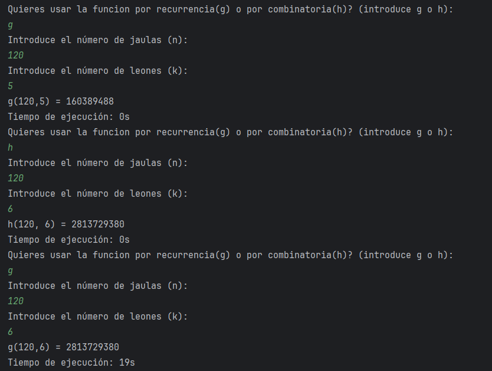
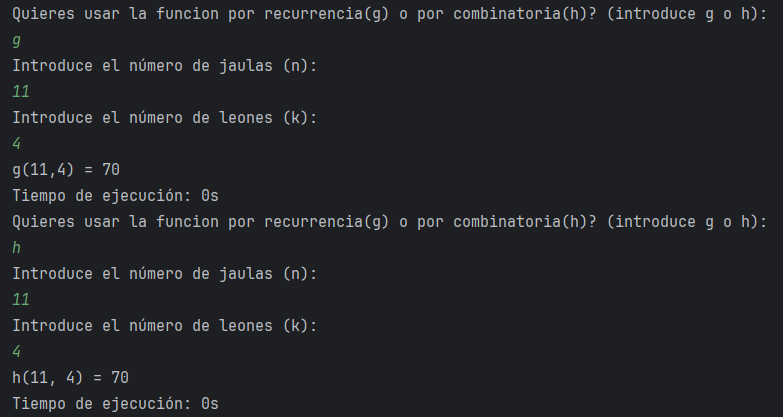

<h2>Sea g(n, k) = número de maneras de colocar k leones en n jaulas, de manera que nunca
haya dos leones en la misma jaula o en jaulas contiguas.</h2>

Algunos resultados:

g(11,4) = 70
g(1,1) = 1    ->   h(1, 1) = 1
g(1,2) = 0    ->   h(1, 2) = 0
g(1,3) = 0    ->   h(1, 3) = 0
g(1,4) = 0    ->   h(1, 4) = 0
g(2,1) = 2    ->   h(2, 1) = 2
g(2,2) = 0    ->   h(2, 2) = 0
g(2,3) = 0    ->   h(2, 3) = 0
g(2,4) = 0    ->   h(2, 4) = 0
g(3,1) = 3    ->   h(3, 1) = 3
g(3,2) = 1    ->   h(3, 2) = 1
g(3,3) = 0    ->   h(3, 3) = 0
g(3,4) = 0    ->   h(3, 4) = 0
g(4,1) = 4    ->   h(4, 1) = 4
g(4,2) = 3    ->   h(4, 2) = 3
g(4,3) = 0    ->   h(4, 3) = 0
g(4,4) = 0    ->   h(4, 4) = 0
g(5,1) = 5    ->   h(5, 1) = 5
g(5,2) = 6    ->   h(5, 2) = 6
g(5,3) = 1    ->   h(5, 3) = 1
g(5,4) = 0    ->   h(5, 4) = 0
g(6,1) = 6    ->   h(6, 1) = 6
g(6,2) = 10    ->   h(6, 2) = 10
g(6,3) = 4    ->   h(6, 3) = 4
g(6,4) = 0    ->   h(6, 4) = 0
g(7,1) = 7    ->   h(7, 1) = 7
g(7,2) = 15    ->   h(7, 2) = 15
g(7,3) = 10    ->   h(7, 3) = 10
g(7,4) = 1    ->   h(7, 4) = 1
g(8,1) = 8    ->   h(8, 1) = 8
g(8,2) = 21    ->   h(8, 2) = 21
g(8,3) = 20    ->   h(8, 3) = 20
g(8,4) = 5    ->   h(8, 4) = 5
g(9,1) = 9    ->   h(9, 1) = 9
g(9,2) = 28    ->   h(9, 2) = 28
g(9,3) = 35    ->   h(9, 3) = 35
g(9,4) = 15    ->   h(9, 4) = 15
g(10,1) = 10    ->   h(10, 1) = 10
g(10,2) = 36    ->   h(10, 2) = 36
g(10,3) = 56    ->   h(10, 3) = 56
g(10,4) = 35    ->   h(10, 4) = 35
g(11,1) = 11    ->   h(11, 1) = 11
g(11,2) = 45    ->   h(11, 2) = 45
g(11,3) = 84    ->   h(11, 3) = 84
g(11,4) = 70    ->   h(11, 4) = 70

